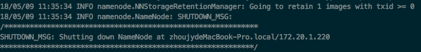
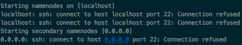
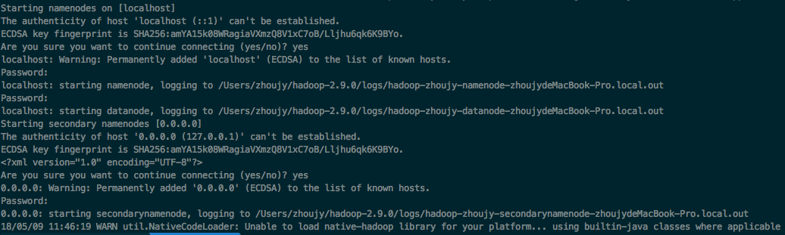
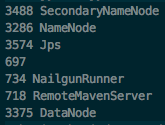
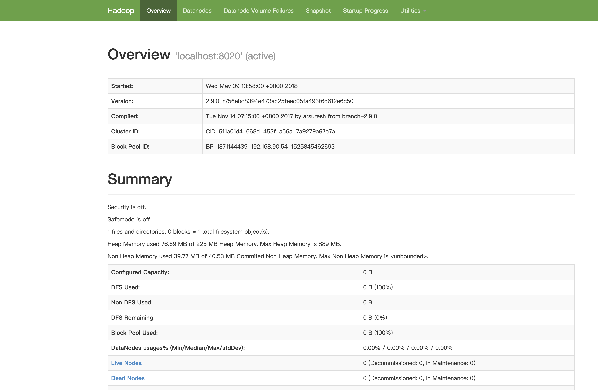
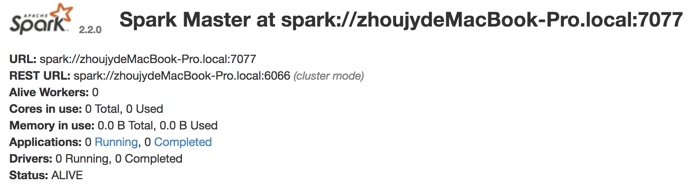
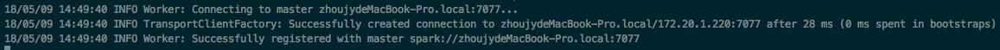
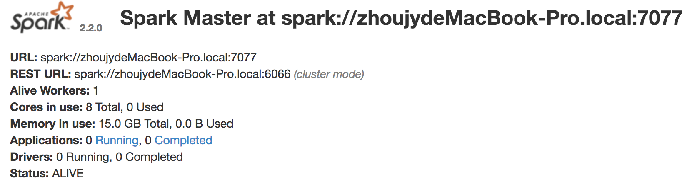

# 一、开始
## 1.hdfs准备
首先去官网下载hadoop的tar包
http://hadoop.apache.org/releases.html

我下载的是2.9.0版本的hadoop

### (1) 下载到本地之后解压，进入相应的文件夹，修改一些参数：

```
$ vim etc/hadoop/core-site.xml
```

```xml
<configuration>
        <property>
                <name>hadoop.tmp.dir</name>
                <value>/home/users/hadoop/hadoop/tmp</value>
        </property>
        <property>
                <name>fs.default.name</name>
                <value>hdfs://localhost:8200</value>
        </property>
</configuration>

```
这里的端口号最好设置为8200，不然可能在运行本地spark程序时发生```Call to localhost/127.0.0.1:8020 failed on connection exception```错误

```
$ vim etc/hadoop/hdfs-site.xml
```

```xml
<configuration>
        <property>
                <name>dfs.datanode.data.dir</name>
                <value>/home/users/hadoop/hadoop/data</value>
        </property>
        <property>
                <name>dfs.namenode.name.dir</name>
                <value>/home/users/hadoop/hadoop/name</value>
        </property>
        <property>
                <name>dfs.http.address</name>
                <value>0.0.0.0:8100</value>
        </property>
        <property>
                <name>dfs.replication</name>
                <value>1</value>
        </property>
</configuration>
```

### (2) namenode格式化
```
$ bin/hdfs namenode -format
```

成功输出如下:



如果在hosts文件中修改过0.0.0.0 这个地址，可能会有错误，建议去掉这层修改

### (3) 开启NameNode和DataNode
```
$ sbin/start-dfs.sh
```

在mac系统中可能会遇到如下问题:



原因是mac没有打开远程访问权限，在```系统偏好设置->共享```中打开远程登录即可

成功运行结果如下：



执行成功后，输入jps查看开启状态
```
$ jps
```



可以看到启动了一个datanode和两个namenode

### (4) web页面查看hdfs服务情况

```http://localhost:8100``` 

8100对应hdfs-site.xml配置文件中的dfs.http.address端口号



至此，hdfs本地环境搭建成功

### (5) 一些命令
停止hdfs：
```
$ sbin/stop-dfs.sh
```

查看hdfs目录：
```
$ bin/hadoop fs -ls /
```

创建文件夹：
```
$ bin/hadoop fs -mkdir /test
```

### (6) 其他问题
如果发现namenode启动但是datanode没有启动，一般是因为重新format了namenode，解决方法参考：

[hadoop伪分布式下 无法启动datanode的原因及解决办法](https://blog.csdn.net/love666666shen/article/details/74350358)


## 2.spark准备
从官网下载spark的包

http://spark.apache.org/downloads.html

这里下载是2.2版本

解压即可使用

bin和sbin目录下有各种启动的脚本

### (1) 命令行启动
```
$ sh bin/spark-shell.sh
```
可以进入spark命令行

### (2) 本地启动spark集群
```
$ sbin/start-master.sh
```
可以启动master，只后再浏览器输入```http://localhost:8080/``` 可以看到master的地址（因人而异）:



可以看到master地址为```spark://zhoujydeMacBook-Pro.local:7077```

根据这个地址，启动worker
```
$ bin/spark-class org.apache.spark.deploy.worker.Worker spark://zhoujydeMacBook-Pro.local:7077
```

看到成功的信息：

成功启动worker后，再看页面，可以看到启动的alive workers 为1


至此spark启动成功，可以在ide中编写spark程序本地运行


# 参考资料
- 1. [Hadoop伪分布式HDFS环境搭建和使用](https://www.cnblogs.com/blog-of-Fourier/p/7515968.html)
- 2. [Spark认识&环境搭建&运行第一个Spark程序](https://www.cnblogs.com/wonglu/p/5901356.html)
- 3. [hadoop伪分布式下 无法启动datanode的原因及解决办法](https://blog.csdn.net/love666666shen/article/details/74350358)
